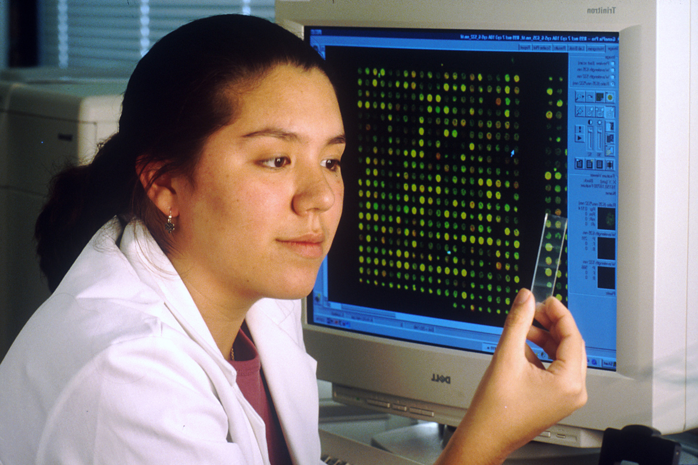

This post is part two in a series of in-progress research updates from the USER team. Also published on the [Superbloom website]([https://simplysecure.org/blog/introducing-user-usable-software-ecosystem-research/](https://simplysecure.org/blog/user-a-work-in-process/).

# USER: A Work In Process

By Katie Wilson

 

Usable Software Ecosystem Research (USER) is a Sloan Foundation-supported research initiative that explores how open source scientific and research software (S&R OSS) teams understand, consider, and undertake usability and design opportunities in their projects. To read more about this project please check out [Blog #1](https://simplysecure.org/blog/introducing-user-usable-software-ecosystem-research/) and check out our [open repo](https://github.com/simplysecure/USER_project).

When we last posted an update about our Usable Software Ecosystem Research (USER) project, we were just wrapping up our 27 interviews and closing our two community surveys. Since February, our six-person research team has collaborated virtually and in-person to analyze the huge amount of qualitative and quantitative data we’ve collected over the course of this project. The process has been daunting at times, but has also been energizing and illuminating. Here we outline some key components of our research process and share a draft excerpt from our findings. 

## In The Thick Of It

USER has presented our team with a challenge: how do we best do deep, human-centered research with a distributed team while working remotely and collaborating equitably? In previous projects, we’ve tried to stay ahead of the synthesis process by using what we call a “Debrief Synthesis Board'' in Miro, where we have a grid-like structure that we can use after completing each interview to capture the most important ideas and findings. This method proved to be difficult in the face of such a wide-ranging and complex research topic. In the end, we organized over 1500 sticky notes over many rounds, into more than 25 categories! 

Our Miro board went from the above debrief grid to the below organization of themes and topics, and then through another two iterations of organization - identifying common themes and then consolidating.

To be sure we captured interviewees’ thoughts and words precisely and in context, we also recorded each interview. We created a codebook that allowed us to filter the quotes by theme and subtheme during our outlining and writing process. Together, the Miro board and the codebook left us with a wealth of evidence. We were both overwhelmed by the data and excited that we had learned so much on so many topics from our interviews. 

## Returning To Our Research Questions

Our synthesis process made it clear that both we and the participants in our project had many thoughts about in response to our research questions. We left data collection with a range of findings, beyond what we initially anticipated. So much can influence the level of attention given to design in these projects, from how visual designers collaborate with them, to the values that scientists bring to technology projects, to how academia, hierarchy, and governance affect prioritization and user-awareness. 

The writing phase required us to re-ground ourselves in our research questions. While we also plan to release our more general findings for the ecosystem, we aim to shed the most light on the particular nuances we uncovered around S&R OSS projects, usability, and design. 

## An Excerpt-in-Progress 

Our final outputs will be published at the end of May, but we’re eager to share a sample of what we’re working on. The following is a piece of the draft chapter on designers’ experiences in S&R OSS projects.

### Designers In Projects Often Need To Justify Design And Educate Others About The Need For It To Get Buy-in

If there are designers in teams working on Open Source Research Software, they are often tasked not only with their work, but with educating the team on how design is done and why it's relevant. This is needed, since design is usually a late addition to projects, after other practices, like collaboration on code, have been established. Without educational work, design would remain an activity that is not seen to be relevant in practice. 

For this, they need to balance both making design its own recognized activity while not being perceived as threatening or opposing existing practices. Designers employed different methods to do this: 

* Presenting design as a “blank slate” without preconceived opinions
* Suggest design activities that do not need a lot of resources, like lightweight usability testing of existing ideas
* Demonstrating the usefulness of design in the context of an ongoing project
* Getting involved in existing discussions rather than opening up new ones

All these methods involve being not threatening and working in existing structures to, ideally, build small wins that demonstrate that design can be a helpful contribution. 

Designers also tried to manage their identity and distanced themselves from values and activities which are seen as “bad ‘in open source projects: “Polishing” (iterating in small steps with strong care for details), “superficiality” (strong care for immediate visual aesthetics), “maximizing clicks” (tracking user actions and compare them to goals) are seen as bad. 

Still, many struggled with achieving a mutual understanding. Designers wished for a “common language” which they tried to work towards by explaining terminology and educating team members. However, even if the terms were there, it did not necessarily translate into their practice when working on the software. 

## What Comes Next

We’re currently editing our outputs for publication at the end of May. Please be sure to keep an eye out for the final drafts, and keep an eye on [our blog](https://simplysecure.org/blog/), [Twitter](https://twitter.com/sprblm_), and [GitHub repo](https://github.com/simplysecure/USER_project) for updates.

## Credits

Project Contributors: [Eriol Fox](https://twitter.com/EriolDoesDesign), [Katie Wilson](https://simplysecure.org/who-we-are/katie/), [Abhishek Sharma](https://twitter.com/abhi1203), [Susan Kennedy](https://twitter.com/smklibrarian), [Ngọc Triệu](https://twitter.com/kirakirawes), [Jan Dittrich](https://twitter.com/simulo), [Meag Doherty](https://twitter.com/EmDohh). 

Image credit: Bill Branson (Photographer) - This image was released by the [National Cancer Institute](https://en.wikipedia.org/wiki/National_Cancer_Institute), an agency part of the [National Institutes of Health](https://en.wikipedia.org/wiki/National_Institutes_of_Health), with the ID [1844](https://visualsonline.cancer.gov/details.cfm?imageid=1844) ([image](https://visualsonline.cancer.gov/retrieve.cfm?imageid=1844&dpi=300&fileformat=jpg)) via [Wikimedia Commons](https://commons.wikimedia.org/wiki/File:Film_Optical_Sensing_Device_for_Input_to_Computers_(FOSDIC).jpg).

With support from the [Sloan Foundation](https://sloan.org/).
